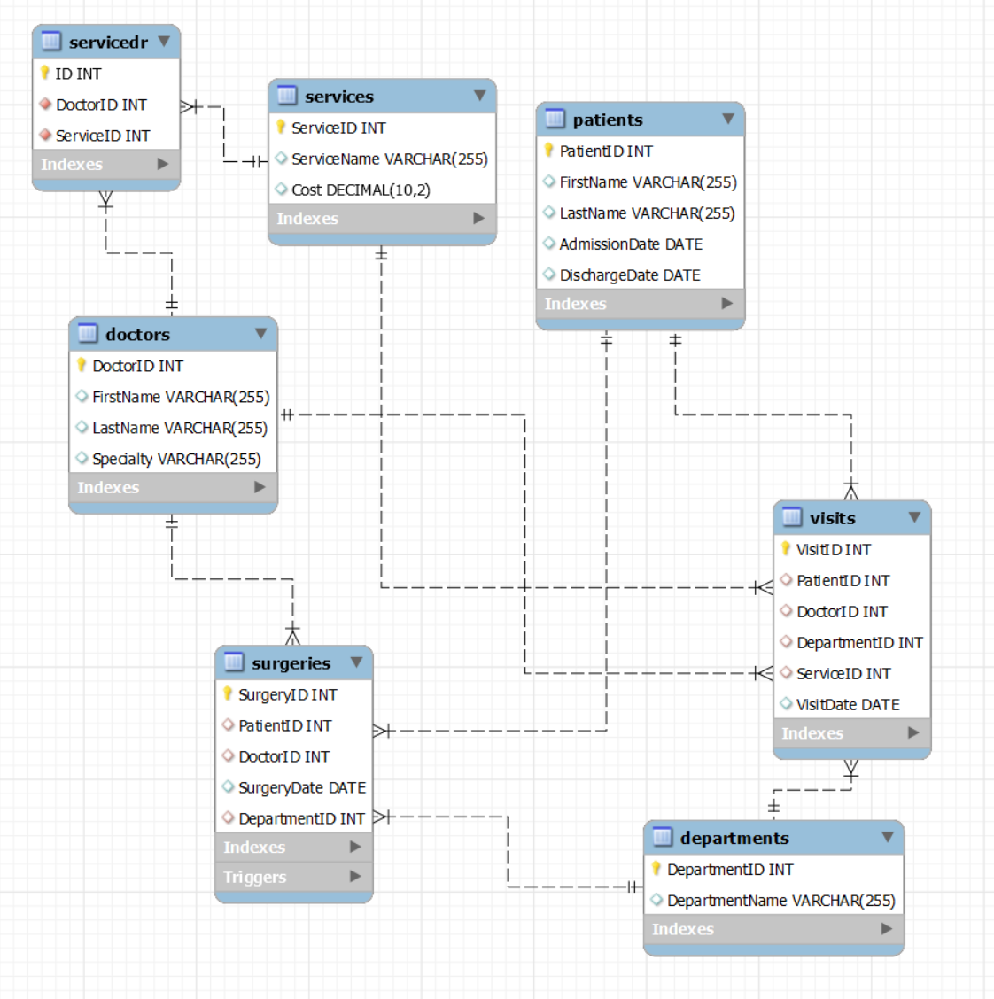

# Hospital Database Management System

## Overview
The Hospital Database Management System is a comprehensive database solution for managing patient records, doctor information, services offered, departments, surgeries, and patient visits within a hospital or healthcare facility. This project aims to streamline and organize the management of healthcare data for efficient hospital operations.

## Key Features
- **Patient Management:** Keep track of patient information, including admission and discharge dates.
- **Doctor Management:** Maintain records of doctors, including their specialties.
- **Services Management:** Record various medical services provided by the hospital.
- **Department Management:** Manage different departments within the hospital.
- **Surgery Management:** Track surgeries scheduled with patient and doctor details.
- **Visit Management:** Record patient visits with relevant details.

## Technologies Used
- **Database:** MySQL
- **Query Language:** SQL
- **Documentation:** Markdown

## Getting Started
1. Clone the repository to your local machine.
2. Import the database using the provided SQL script.
3. Explore and use the database for your healthcare management needs.

## Usage
This project can serve as a foundation for developing a robust Hospital Management System. You can extend its functionality, integrate with other systems, and build a user interface for administrators and staff to manage hospital operations efficiently.

## Contribution
Contributions are welcome! Whether you want to improve the database schema, add new features, or enhance documentation, feel free to open an issue or submit a pull request.

## License
This project is licensed under the MIT License. See the LICENSE file for details.


***


# Hospital Database Project

This is a sample project that demonstrates the creation of a hospital database using SQL. The project includes SQL scripts to create the database, insert sample records, and generate views for various reports.

## Project Files

- `creating_database.sql`: SQL script to create the database schema and tables.
- `new_records.sql`: SQL script to insert sample records into the database.
- `create_reports.sql`: SQL script to generate six different table views for reports.
- `erd.png`: Entity-Relationship Diagram (ERD) for the database.
---
## Database Tables and Records

The database consists of the following tables with sample records:
| Table Name                    | Total Records |
| ----------------------------- | ------------- |
| Patients Table                | 46            |
| Doctors Table                 | 40            |
| Services Table                | 44            |
| Departments Table             | 4             |
| Surgeries Table               | 17            |
| Service-Doctor Relationship   | 63            |
| Visits Table                  | 40            |

---
## Setup Instructions

To set up the project and the database, follow these steps:

1. **Database Creation**: Run the `creating_database.sql` script to create the database schema and tables.

```sql
mysql -u your_username -p < creating_database.sql
```
Replace `your_username` with your MySQL username, and you'll be prompted to enter your password.

2. **Insert Sample Records**: Run the `new_records.sql` script to insert sample records into the database.

```sql
mysql -u your_username -p < new_records.sql
```
3. **Generate Reports**: Run the `create_reports.sql` script to generate six different table views for reports. These views will allow you to query and analyze the data.

```sql
mysql -u your_username -p < create_reports.sql
```
---
## Generated Views
**The `create_reports.sql` script generates the following views which first row indicates their names**:

* ***report_1_Patients_with_10_days_staying*** :
   - **`Patients with 10+ Days Staying`** 
   - Query to get patients admitted on '2022-04-10' and stayed for 10 days or more.

* ***report_2_Doctors_visited_patients***: 
   -  **`Doctors Who Visited Patients`**
   -  Query to get doctors who visited patients admitted on '2022-04-10' and stayed for 10 days or more.

* ***report_3_patieng_surgery_spring***:
   -  **`Patients with Surgery in Spring`**
   -  Query to get patients who had surgery in spring and the surgeon is Dr. Emily Brown.

* ***report_4_services_of_inpatient_dept***:
   -  **`Services in Inpatient Department`**
   -  Query to get services received by patients in the inpatient department.

* ***report_5_doctor_service***:
   -  **`Services Provided by Dr. Emily Brown`**
   -  Query to get services provided by Dr. Emily Brown.

* ***report_6_cost_of_services***: 
   -  **`Cost of Services for Patient Bob Johnson`**
   -  Query to get the total cost of services for a patient named Bob Johnson in the inpatient department.
---
## Entity-Relationship Diagram (ERD)


##### The ERD provides a visual representation of the database structure.
---
##Notes
You may need to adjust the database connection settings in the SQL scripts according to your MySQL configuration.
Feel free to use this project as a reference for creating and setting up a database system. If you have any questions or encounter issues, please reach out for assistance.

**Author: Ramin Yazdani**


---
---
---
---
---
###DATA in database
### departments
| Column Name  | Data Type     | Attributes    |
|-------------- |-------------- | ------------- |
| DepartmentID  | INT           | NOT NULL AUTO_INCREMENT |
| DepartmentName  | VARCHAR(255)  | NULL DEFAULT NULL |
| **Primary Key**  | DepartmentID |
| **Indexes**     | -             |

### doctors
| Column Name  | Data Type     | Attributes    |
|-------------- |-------------- | ------------- |
| DoctorID      | INT           | NOT NULL AUTO_INCREMENT |
| FirstName     | VARCHAR(255)  | NULL DEFAULT NULL |
| LastName      | VARCHAR(255)  | NULL DEFAULT NULL |
| Specialty     | VARCHAR(255)  | NULL DEFAULT NULL |
| **Primary Key**  | DoctorID |
| **Indexes**     | idx_DoctorID  |

### patients
| Column Name  | Data Type     | Attributes    |
|-------------- |-------------- | ------------- |
| PatientID     | INT           | NOT NULL AUTO_INCREMENT |
| FirstName     | VARCHAR(255)  | NULL DEFAULT NULL |
| LastName      | VARCHAR(255)  | NULL DEFAULT NULL |
| AdmissionDate | DATE          | NULL DEFAULT NULL |
| DischargeDate | DATE          | NULL DEFAULT NULL |
| **Primary Key**  | PatientID |
| **Indexes**     | idx_AdmissionDate  |

### services
| Column Name  | Data Type     | Attributes    |
|-------------- |-------------- | ------------- |
| ServiceID     | INT           | NOT NULL AUTO_INCREMENT |
| ServiceName   | VARCHAR(255)  | NULL DEFAULT NULL |
| Cost          | DECIMAL(10,2) | NULL DEFAULT NULL |
| **Primary Key**  | ServiceID |
| **Indexes**     | -  |

### surgeries
| Column Name  | Data Type     | Attributes    |
|-------------- |-------------- | ------------- |
| SurgeryID     | INT           | NOT NULL AUTO_INCREMENT |
| PatientID     | INT           | NULL DEFAULT NULL |
| DoctorID      | INT           | NULL DEFAULT NULL |
| SurgeryDate   | DATE          | NULL DEFAULT NULL |
| DepartmentID  | INT           | NULL           |
| **Primary Key**  | SurgeryID |
| **Indexes**     | PatientID, DoctorID, idx_SurgeryDate, surgeries_ibfk_3_idx  |
| **Foreign Keys** | 
| - SurgeryID (REFERENCES hospitaldb.patients.PatientID) |
| - DoctorID (REFERENCES hospitaldb.doctors.DoctorID) |
| - DepartmentID (REFERENCES hospitaldb.departments.DepartmentID) |

### visits
| Column Name  | Data Type     | Attributes    |
|-------------- |-------------- | ------------- |
| VisitID       | INT           | NOT NULL AUTO_INCREMENT |
| PatientID     | INT           | NULL DEFAULT NULL |
| DoctorID      | INT           | NULL DEFAULT NULL |
| DepartmentID  | INT           | NULL DEFAULT NULL |
| ServiceID     | INT           | NULL DEFAULT NULL |
| VisitDate     | DATE          | NULL DEFAULT NULL |
| **Primary Key**  | VisitID |
| **Indexes**     | PatientID, DoctorID, idx_DepartmentID, idx_ServiceID  |
| **Foreign Keys** | 
| - PatientID (REFERENCES hospitaldb.patients.PatientID) |
| - DoctorID (REFERENCES hospitaldb.doctors.DoctorID) |
| - DepartmentID (REFERENCES hospitaldb.departments.DepartmentID) |
| - ServiceID (REFERENCES hospitaldb.services.ServiceID) |

### ServiceDr
| Column Name  | Data Type     | Attributes    |
|-------------- |-------------- | ------------- |
| ID            | INT           | NOT NULL AUTO_INCREMENT |
| DoctorID      | INT           | NOT NULL |
| ServiceID     | INT           | NOT NULL |
| **Primary Key**  | ID |
| **Indexes**     | s_ifk_idx, dr_ifk_idx  |
| **Unique Key**  | DoctorID, ServiceID |
| **Foreign Keys** | 
| - ServiceID (REFERENCES hospitaldb.services.ServiceID) |
| - DoctorID (REFERENCES hospitaldb.doctors.DoctorID) |

### Trigger - surgeries_check_date
This trigger checks if the `SurgeryDate` is between the `AdmissionDate` and `DischargeDate` of the patient. It is executed before inserting a new record into the `surgeries` table.


## Patients Table

| ID  | FirstName | LastName | AdmissionDate | DischargeDate |
|---- |-----------|----------|---------------|-------------- |
| 1   | John      | Doe      | 2022-01-01    | 2022-01-10    |
| 2   | Alice     | Smith    | 2022-02-15    | 2022-02-25    |
| 3   | Bob       | Johnson  | 2022-04-10    | 2022-04-20    |
| 4   | Mahsa     | Nejad    | 2022-04-10    | 2022-04-20    |
| 5   | Radin     | Yazdani  | 2022-04-10    | 2022-04-20    |
| 6   | Emma      | Williams | 2022-05-01    | 2022-05-12    |
| 7   | Michael   | Brown    | 2022-07-10    | 2022-07-20    |
| 8   | Olivia    | Davis    | 2022-08-15    | 2022-08-25    |
| 9   | John      | Doe      | 2022-01-10    | 2022-01-15    |
| 10  | Alice     | Smith    | 2022-02-05    | 2022-02-12    |
| 11  | Robert    | Johnson  | 2022-03-20    | 2022-03-27    |
| 12  | Linda     | Brown    | 2022-04-15    | 2022-04-21    |
| 13  | David     | Wilson   | 2022-05-12    | 2022-05-20    |
| 14  | Mary      | Davis    | 2022-06-10    | 2022-06-20    |
| 15  | Michael   | Jones    | 2022-07-05    | 2022-07-12    |
| 16  | Jennifer  | Taylor   | 2022-08-20    | 2022-08-27    |
| 17  | William   | Miller   | 2022-09-15    | 2022-09-21    |
| 18  | Sarah     | Anderson | 2022-10-12    | 2022-10-20    |
| 19  | James     | Brown    | 2022-11-10    | 2022-11-20    |
| 20  | Karen     | Harris   | 2022-12-05    | 2022-12-12    |
| 21  | Thomas    | White    | 2023-01-20    | 2023-01-27    |
| 22  | Susan     | Moore    | 2023-02-15    | 2023-02-21    |
| 23  | Richard   | Hall     | 2023-03-12    | 2023-03-20    |
| 24  | Maria     | Garcia   | 2023-04-05    | 2023-04-15    |
| 25  | Daniel    | Moore    | 2023-04-10    | 2023-04-20    |
| 26  | Elizabeth | Perez    | 2023-05-12    | 2023-05-22    |
| 27  | Samuel    | Smith    | 2023-05-20    | 2023-05-30    |
| 28  | Olivia    | Rodriguez | 2023-06-01    | 2023-06-11    |
| 29  | Benjamin  | Harris   | 2023-06-10    | 2023-06-20    |
| 30  | Alexander  | Lewis    | 2023-07-10    | 2023-07-20    |
| 31  | Chloe     | Johnson  | 2023-07-15    | 2023-07-25    |
| 32  | Evelyn    | Turner   | 2023-08-05    | 2023-08-15    |
| 33  | Thomas    | Davis    | 2023-08-10    | 2023-08-20    |
| 34  | Grace     | Scott    | 2023-09-01    | 2023-09-11    |
| 35  | William   | Walker   | 2023-09-10    | 2023-09-20    |
| 36  | Lily      | King     | 2023-10-01    | 2023-10-11    |
| 37  | David     | Martinez  | 2023-10-05    | 2023-10-15    |
| 38  | Harper    | Phillips  | 2023-11-05    | 2023-11-15    |
| 39  | Jack      | Scott    | 2023-11-10    | 2023-11-20    |
| 40  | Emily     | Turner   | 2023-12-01    | 2023-12-11    |
| 41  | Daniel    | Green    | 2023-12-05    | 2023-12-15    |
| 42  | Ella      | Carter   | 2024-01-01    | 2024-01-11    |
| 43  | Matthew   | King     | 2024-01-10    | 2024-01-20    |

## Doctors Table

| DoctorID | FirstName | LastName |      Specialty       |
|--------- |-----------|----------|--------------------- |
|    1     | Dr. Olivia |  Smith   | Cardiologist         |
|    2     | Dr. James  |  Johnson | Neurologist          |
|    3     | Dr. Emily  |  Brown   | Dermatologist        |
|    4     | Dr. Robert |  Wilson  | Orthopedist          |
|    5     | Dr. Jessica | Harris   | Gastroenterologist   |
|    6     | Dr. Daniel |  Clark   | Cardiologist         |
|    7     | Dr. Sarah  |  Martinez | Neurologist          |
|    8     | Dr. Michael | Moore   | Orthopedist          |
|    9     | Dr. Emily  |  Garcia  | Dermatologist        |
|    10    | Dr. William | Taylor  | Gastroenterologist   |
|    11    | Dr. Jennifer | Davis   | Oncologist           |
|    12    | Dr. Kevin  |  Anderson | Pediatrician         |
|    13    | Dr. Sophia  | White   | Surgeon              |
|    14    | Dr. Benjamin | Smith   | ENT Specialist        |
|    15    | Dr. Ava  |  Perez   | Urologist            |
|    16    | Dr. David  | Roberts  | Nephrologist         |
|    17    | Dr. Grace  |  Jones   | Radiologist          |
|    18    | Dr. Mason  |  Wilson  | Psychiatrist         |
|    19    | Dr. Emily  |  Hall    | Internal Medicine    |
|    20    | Dr. John  |  Martin  | Endocrinologist       |
|    21    | Dr. Victoria  | Young   | Cardiologist         |
|    22    | Dr. Michael  | Williams | Neurologist          |
|    23    | Dr. Amelia  |  Garcia  | Dermatologist        |
|    24    | Dr. Daniel  |  Taylor  | Orthopedist          |
|    25    | Dr. Grace  |  Harris  | Gastroenterologist   |
|    26    | Dr. Benjamin  | Clark   | Cardiologist         |
|    27    | Dr. Lily  |  Moore   | Neurologist          |
|    28    | Dr. David  |  Thomas  | Orthopedist          |
|    29    | Dr. Olivia  |  Hall    | Dermatologist        |
|    30    | Dr. William  | Wilson  | Gastroenterologist   |
|    31    | Dr. Michael  | Anderson | Oncologist           |
|    32    | Dr. Sophia  |  Roberts | Pediatrician         |
|    33    | Dr. Andrew  |  Davis   | Surgeon              |
|    34    | Dr. Emily  |  Lewis   | ENT Specialist        |
|    35    | Dr. James  |  Jones   | Urologist            |
|    36    | Dr. Victoria  | Young   | Nephrologist         |
|    37    | Dr. Ava  |  Hall    | Radiologist          |
|    38    | Dr. Daniel  |  Martin  | Psychiatrist         |
|    39    | Dr. Sophia  |  White   | Internal Medicine    |
|    40    | Dr. Benjamin  | Perez   | Endocrinologist       |

## Services Table

| ServiceID |      ServiceName      |   Cost    |
|---------- |----------------------- |---------  |
|     1     | Cardiology Consultation | $120.00  |
|     2     | Cardiac Stress Test     | $200.00  |
|     3     | Cardiac Catheterization | $500.00  |
|     4     | Neurology Consultation  | $150.00  |
|     5     | MRI Brain Scan          | $300.00  |
|     6     | EEG Test                | $180.00  |
|     7     | Dermatology Evaluation   | $100.00  |
|     8     | Skin Biopsy             | $150.00  |
|     9     | Laser Hair Removal      | $250.00  |
|     10    | Orthopedic Surgery      | $600.00  |
|     11    | Orthopedic Consultation  | $130.00  |
|     12    | Physical Therapy        | $90.00   |
|     13    | Gastroenterology Checkup | $180.00  |
|     14    | Colonoscopy             | $250.00  |
|     15    | Liver Function Test     | $120.00  |
|     16    | Oncology Screening      | $250.00  |
|     17    | Chemotherapy Session    | $350.00  |
|     18    | Radiation Therapy       | $400.00  |
|     19    | Pediatric Checkup       | $90.00   |
|     20    | Vaccination             | $50.00   |
|     21    | Child Growth Assessment | $80.00   |
|     22    | General Surgery         | $800.00  |
|     23    | Appendectomy            | $500.00  |
|     24    | Gallbladder Removal     | $700.00  |
|     25    | ENT Specialist Visit    | $110.00  |
|     26    | Hearing Test            | $80.00   |
|     27    | Tonsillectomy           | $400.00  |
|     28    | Urology Consultation    | $140.00  |
|     29    | Cystoscopy              | $250.00  |
|     30    | Prostate Exam           | $120.00  |
|     31    | Nephrology Consultation | $160.00  |
|     32    | Kidney Function Test     | $100.00  |
|     33    | Dialysis Session        | $350.00  |
|     34    | Radiology X-Ray         | $80.00   |
|     35    | CT Scan                 | $180.00  |
|     36    | MRI Imaging             | $250.00  |
|     37    | Psychiatry Session      | $120.00  |
|     38    | Counseling Session      | $90.00   |
|     39    | Medication Management   | $60.00   |
|     40    | Internal Medicine Consultation | $150.00  |
|     41    | Blood Pressure Check    | $50.00   |

## Departments Table

| DepartmentID | DepartmentName |
|------------- |---------------- |
|      1      | Inpatient       |
|      2      | Operating Room  |
|      3      | Emergency       |
|      4      | Intensive Care  |

## Surgeries Table

| SurgeryID | PatientID | DoctorID | SurgeryDate | DepartmentID |
|--------- |---------- |--------- |------------ |------------- |
|    1     |    1     |    1     |  2022-01-05  |      1       |
|    2     |    2     |    2     |  2022-02-20  |      2       |
|    3     |    3     |    3     |  2022-04-15  |      3       |
|    4     |    4     |    3     |  2022-04-15  |      3       |
|    5     |    5     |    3     |  2022-04-15  |      3       |
|    6     |    6     |    4     |  2022-05-05  |      4       |
|    7     |    7     |    5     |  2022-07-15  |      1       |
|    8     |    8     |    6     |  2022-08-20  |      2       |
|    9     |    9     |    7     |  2022-01-12  |      3       |
|    10    |   10     |    8     |  2022-02-11  |      4       |
|    11    |   11     |    9     |  2022-03-25  |      1       |
|    12    |   12     |   10     |  2022-04-18  |      2       |
|    13    |   13     |   11     |  2022-05-15  |      3       |
|    14    |   14     |   12     |  2022-06-15  |      4       |
|    15    |   15     |   13     |  2022-07-10  |      1       |
|    16    |   16     |   14     |  2022-08-22  |      2       |
|    17    |   17     |   15     |  2022-09-17  |      3       |

## ServiceDr Table

| ID | DoctorID | ServiceID |
|----|----------|-----------|
| 1  | 1        | 1         |
| 2  | 1        | 2         |
| 3  | 1        | 3         |
| 4  | 2        | 4         |
| 5  | 2        | 5         |
| 6  | 2        | 6         |
| 7  | 3        | 7         |
| 8  | 3        | 8         |
| 9  | 4        | 9         |
| 10 | 4        | 10        |
| 11 | 5        | 11        |
| 12 | 5        | 12        |
| 13 | 6        | 13        |
| 14 | 7        | 14        |
| 15 | 8        | 15        |
| 16 | 9        | 16        |
| 17 | 10       | 17        |
| 18 | 11       | 18        |
| 19 | 12       | 19        |
| 20 | 13       | 20        |
| 21 | 14       | 21        |
| 22 | 15       | 22        |
| 23 | 16       | 23        |
| 24 | 17       | 24        |
| 25 | 18       | 25        |
| 26 | 19       | 26        |
| 27 | 20       | 27        |
| 28 | 21       | 28        |
| 29 | 22       | 29        |
| 30 | 23       | 30        |
| 31 | 24       | 31        |
| 32 | 25       | 32        |
| 33 | 26       | 33        |
| 34 | 27       | 34        |
| 35 | 28       | 35        |
| 36 | 29       | 36        |
| 37 | 30       | 37        |
| 38 | 31       | 38        |
| 39 | 32       | 39        |
| 40 | 33       | 40        |
| 41 | 34       | 41        |
| 42 | 35       | 1         |
| 43 | 36       | 2         |
| 44 | 37       | 3         |
| 45 | 38       | 4         |
| 46 | 39       | 5         |
| 47 | 40       | 6         |

## Visits Table

| VisitID | PatientID | DoctorID | DepartmentID | ServiceID | VisitDate  |
|---------|-----------|----------|--------------|-----------|------------|
| 1       | 1         | 1        | 1            | 1         | 2023-01-15 |
| 2       | 2         | 2        | 1            | 2         | 2023-02-25 |
| 3       | 3         | 3        | 1            | 3         | 2022-04-10 |
| 4       | 3         | 2        | 1            | 1         | 2022-04-10 |
| 5       | 3         | 1        | 1            | 1         | 2022-04-10 |
| 6       | 3         | 3        | 1            | 2         | 2022-04-12 |
| 7       | 3         | 4        | 1            | 2         | 2022-04-12 |
| 8       | 3         | 1        | 1            | 3         | 2022-04-12 |
| 9       | 3         | 2        | 1            | 3         | 2022-04-12 |
| 10      | 3         | 3        | 1            | 2         | 2022-04-12 |
| 11      | 3         | 3        | 1            | 2         | 2022-04-12 |
| 12      | 4         | 4        | 2            | 4         | 2023-05-15 |
| 13      | 5         | 5        | 3            | 7         | 2023-07-25 |
| 14      | 6         | 6        | 4            | 9         | 2023-01-02 |
| 15      | 7         | 7        | 1            | 1         | 2023-01-03 |
| 16      | 8         | 8        | 1            | 2         | 2023-01-04 |
| 17      | 9         | 9        | 1            | 3         | 2023-01-05 |
| 18      | 10        | 10       | 1            | 3         | 2023-01-06 |
| 19      | 11        | 11       | 1            | 3         | 2023-01-07 |
| 20      | 12        | 12       | 1            | 3         | 2023-01-08 |
| 21      | 13        | 13       | 1            | 3         | 2023-01-09 |
| 22      | 14        | 14       | 1            | 4         | 2023-01-10 |
| 23      | 15        | 15       | 1            | 4         | 2023-01-11 |
| 24      | 16        | 16       | 1            | 2         | 2023-01-12 |
| 25      | 17        | 17       | 4            | 10        | 2023-01-13 |
| 26      | 18        | 18       | 4            | 10        | 2023-01-14 |
| 27      | 19        | 19       | 4            | 10        | 2023-01-15 |
| 28      | 20        | 20       | 4            | 9         | 2023-01-16 |
| 29      | 21        | 21       | 3            | 8         | 2023-01-17 |
| 30      | 22        | 22       | 2            | 6         | 2023-01-18 |
| 31      | 23        | 23       | 2            | 5         | 2023-01-19 |
| 32      | 24        | 24       | 4            | 9         | 2023-01-20 |
| 33      | 25        | 25       | 4            | 9         | 2023-01-21 |
| 34      | 26        | 26       | 4            | 9         | 2023-01-22 |
| 35      | 27        | 27       | 4            | 10        | 2023-01-23 |
| 36      | 28        | 28       | 4            | 10        | 2023-01-24 |
| 37      | 29        | 29       | 4            | 10        | 2023-01-25 |
| 38      | 30        | 30       | 4            | 9         | 2023-01-26 |
| 39      | 31        | 31       | 3            | 8         | 2023-01-27 |
| 40      | 32        | 32       | 2            | 6         | 2023-01-28 |
| 41      | 33        | 33       | 2            | 5         | 2023-01-29 |
| 42      | 34        | 34       | 4            | 7         | 2023-01-30 |
| 43      | 35        | 35       | 4            | 7         | 2023-01-31 |
| 44      | 36        | 36       | 4            | 8         | 2023-02-01 |
| 45      | 37        | 37       | 4            | 8         | 2023-02-02 |
| 46      | 38        | 38       | 1            | 1         | 2023-02-03 |
| 47      | 39        | 39       | 1            | 1         | 2023-02-04 |
| 48      | 40        | 40       | 1            | 1         | 2023-02-05 |
